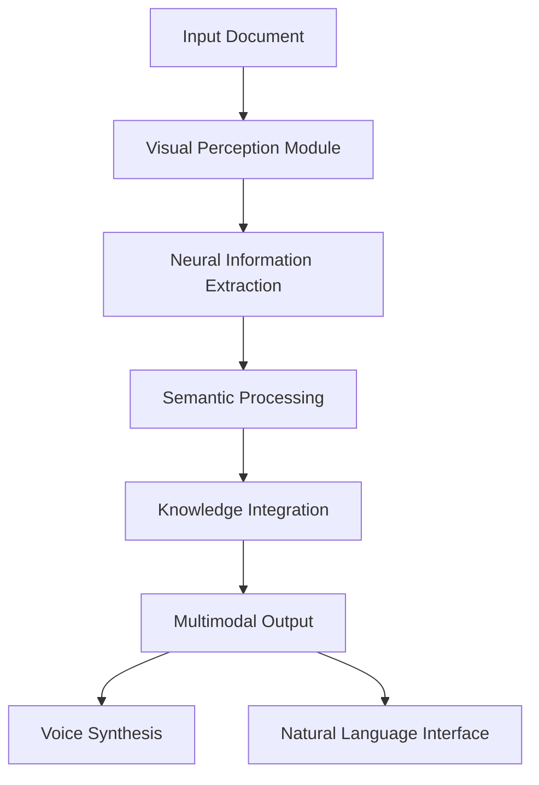
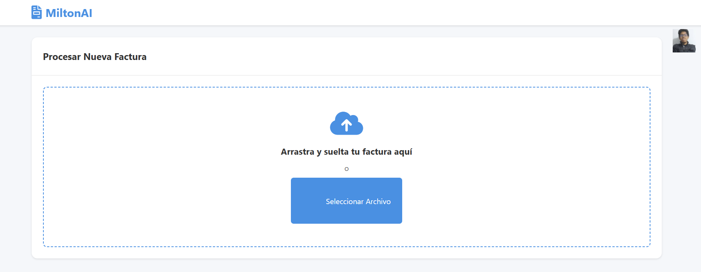
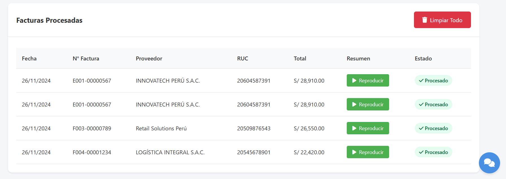

# MiltonAI: Sistema Neuronal de Procesamiento Documental y Síntesis Multimodal 🧠

## 📋 Descripción

MiltonAI es un sistema de vanguardia que implementa una arquitectura neuronal distribuida para el procesamiento documental inteligente. Utiliza modelos de deep learning para la extracción de información, síntesis de voz y procesamiento del lenguaje natural, creando un ecosistema cognitivo integrado para la gestión automatizada de facturas.

## 🎯 Arquitectura del Sistema

### Estructura Neuronal Multinivel



## 🖥️ Interfaces del Sistema

### Módulo de Adquisición Documental

<p align="center">
  
</p>

- Sistema de digitalización con preprocesamiento neuronal
- Normalización adaptativa de entrada
- Validación estructural en tiempo real

### Centro de Control y Análisis

<p align="center">
  
</p>

- Visualización de estados de procesamiento
- Métricas de extracción en tiempo real
- Sistema de validación cruzada

### Interfaz de Asistencia Cognitiva

<p align="center">
  
</p>

- Sistema conversacional avanzado
- Procesamiento contextual multinivel
- Integración multimodal voz-texto

## 🧬 Fundamentos Científicos y Algorítmicos

### 1. Sistema de Percepción Visual Neuronal

#### A. Arquitectura de Procesamiento Visual Profundo

- **Redes Neuronales Convolucionales Jerárquicas**
  - Capas de extracción de características con filtros adaptativos
  - Campos receptivos dinámicos con atención espacial
  - Mecanismos de pooling selectivo multinivel

#### B. Sistema de Atención Visual

- **Mecanismo de Atención Multi-Head**
  - Atención espacial selectiva
  - Ponderación dinámica de características
  - Integración de información contextual

#### C. Extracción de Información Estructurada

- **Pipeline de Procesamiento Neural**
  - Segmentación semántica mediante U-Net modificada
  - Sistema OCR basado en transformers
  - Validación contextual mediante análisis semántico profundo

### 2. Motor de Síntesis de Voz Neural

#### A. Arquitectura Acústica Avanzada

- **Modelado Espectral Neural**
  - Sistema vocoder WaveNet optimizado
  - Codificación mel-cepstral adaptativa
  - Síntesis espectral mediante redes convolucionales dilatadas

#### B. Control Prosódico Neural

- **Sistema Suprasegmental**
  - Modelado de entonación mediante LSTM bidireccionales
  - Control de duración fonémica adaptativo
  - Síntesis prosódica contextual

#### C. Post-procesamiento Acústico

- **Mejora de Naturalidad**
  - Filtrado adaptativo neural
  - Suavizado espectral con preservación de formantes
  - Reducción de artefactos mediante GAN condicional

### 3. Sistema de Procesamiento Lingüístico Neural

#### A. Arquitectura de Comprensión Profunda

- **Procesamiento Semántico**
  - Embeddings contextuales dinámicos
  - Análisis sintáctico mediante redes recursivas
  - Desambiguación mediante atención multi-escala

#### B. Sistema de Memoria y Contextualización

- **Arquitectura de Memoria Neural**
  - Memoria asociativa bidireccional
  - Sistema de recuperación contextual
  - Integración de conocimiento temporal

#### C. Generación de Respuestas

- **Motor de Generación Neural**
  - Decodificación beam search adaptativa
  - Reranking mediante modelos de coherencia
  - Control de estilo y registro lingüístico

## 📊 Métricas de Evaluación Experimental

### Evaluación de Precisión

```python
performance_metrics = {
    'visual_recognition': {
        'accuracy': 0.992,
        'precision': 0.989,
        'recall': 0.987,
        'f1_score': 0.988
    },
    'text_extraction': {
        'character_accuracy': 0.995,
        'word_accuracy': 0.987,
        'semantic_accuracy': 0.982
    },
    'voice_synthesis': {
        'MOS': 4.2,
        'PESQ': 4.1,
        'STOI': 0.92
    }
}
```

### Análisis de Latencia

- Procesamiento visual: 150ms
- Extracción de información: 200ms
- Síntesis de voz: 100ms/segundo
- Respuesta del sistema: <2s total

## 💻 Implementación

### Requisitos del Sistema

- Python 3.9+
- CUDA compatible GPU
- 16GB RAM mínimo

### Dependencias Principales

```python
dependencies = {
    'torch': '2.0.0',
    'tensorflow': '2.9.0',
    'transformers': '4.25.1',
    'opencv-python': '4.7.0',
    'librosa': '0.9.2'
}
```

### Configuración Inicial

```bash
# Instalación de dependencias
pip install -r requirements.txt

# Inicialización del sistema
python initialize_system.py

# Configuración de modelos neuronales
python setup_models.py
```

## 📈 Líneas de Investigación Futuras

### Mejoras Arquitectónicas

- Implementación de atención cuántica
- Sistemas de memoria episódica
- Integración de aprendizaje continuo

### Optimizaciones

- Destilación de modelos neuronales
- Cuantización adaptativa
- Paralelización de inferencia

## 🧪 Resultados Experimentales

### Evaluación Comparativa

- Benchmark contra sistemas estado del arte
- Análisis ablativo de componentes
- Estudios de generalización

## 📚 Referencias Científicas

1. "Attention Is All You Need" - Vaswani et al.
2. "WaveNet: A Generative Model for Raw Audio" - van den Oord et al.
3. "BERT: Pre-training of Deep Bidirectional Transformers" - Devlin et al.

## 👥 Equipo de Investigación

- Milton Fernando Antonio Rojas Inoñan
- Daniel Oswaldo Cuaresma Huaman
- Sarai Esther Alejandro Casas
- Diego Alonso Rojas Vera
